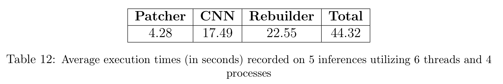
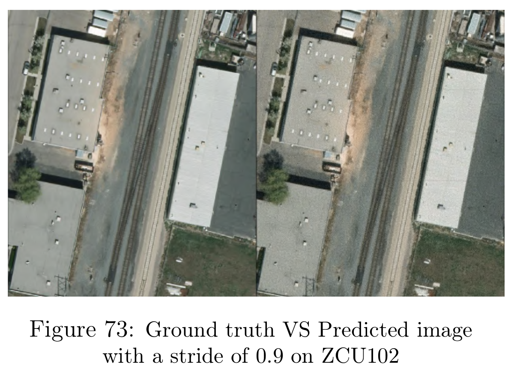
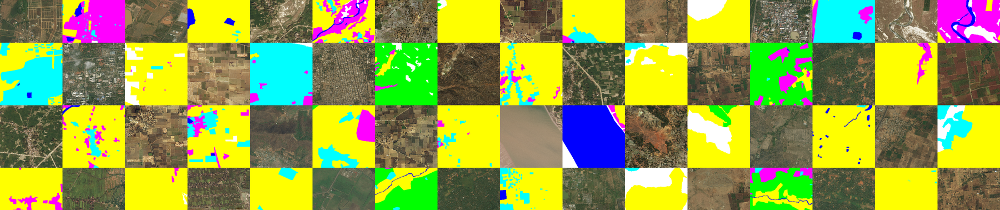
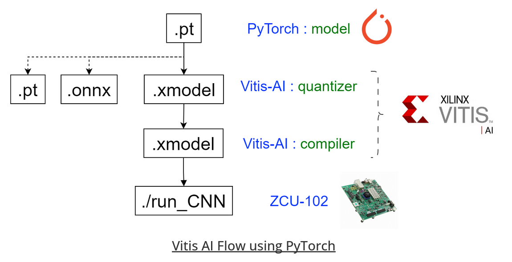

# A super resolution AI on ZCU102

The SuperRes7 project is part of an Industrial Study Project (BEI) and a Projet Long of ENSEEIHT. The objective of this project is to develop an embedded application for satellite image super-resolution using AI techniques. The application should be capable of being deployed on an already-orbiting satellite. The system is a sandbox (thus reconfigurable) and is equipped with an optical sensor capable of capturing RGB images with a resolution of 14192x10640 (150 million pixels), so the objective is to generate an output of size 28384x21280.

Once the image is super resolved, we will try to integrate a segmentation model in order to remove unnecessary areas, such as water and forests.

# Results

The final super-resolution application upscales an image from **14192x10640px** to an image of **28384x21280px** in **44.32s**, with the entire process executed on the ZCU102 (image patching, super-resolution model inference, image reconstruction), all while using less than 3GB of RAM.





# How to train the super-resolution model

Download our datasets [here](https://drive.google.com/drive/folders/1xJYEhfPTt9Ox6RwFbfRrWGRmBvW3IX2l?usp=sharing) (extracted from [Cars Overhead With Context](https://gdo152.llnl.gov/cowc/) and [DeepGlobe Land Cover Classification Dataset](https://www.kaggle.com/datasets/balraj98/deepglobe-land-cover-classification-dataset)) and copy it in the SuperRes7 repo.
You should have this structure:
```
SuperRes7
├── doc
├── pkgs
├── pt_vai_flow
│   ├── build
│   ├── code
│   └── input_model
├── seg_dataset
│   ├── test
│   │   ├── image
│   │   └── mask
│   └── train
│       ├── image
│       └── mask
├── seg_training
├── supres_dataset
│   ├── test
│   │   ├── blr
│   │   └── gt
│   └── train
│       ├── blr
│       └── gt
├── supres_training
├── target_zcu102
│   ├── code
│   ├── input
│   └── models
└── tf_vai_flow
    ├── build
    ├── code
    └── input_model
```

To begin with, you need to install the required packages:
```bash
pip3 install -r requirements.txt
```

Our model is an FSRCNN adapted from "*[Accelerating the Super-Resolution Convolutional Neural Network](https://arxiv.org/abs/1608.00367)*" with the following parameters:

| D  | S  | M |
|----|----|---|
| 56 | 16 | 6 |

<br>
To train our model, please run this Python script:

```bash
python3 FSRCNN_train.py
```

Here are all options :
```bash
options:
  --dataset_path DATASET_PATH   Path to the dataset
  --params_path PARAMS_PATH     Path to the training parameters in the .json file
```

## How to train with your own dataset

We provide a Python script that allows you to create your dataset with your own images:
```bash
python3 create_dataset.py --input_dir path-to-your-images
```

Here are all options :

```bash
options:
  --input_dir INPUT_DIR       Path to input image directory
  --hr_dir HR_DIR             Path to save high-resolution patches
  --blr_dir BLR_DIR           Path to save blurred low res patches
  --kernel_path KERNEL_PATH   Path to blur kernel
  --stride STRIDE             Stride ratio for patch extraction
  --patch_size PATCH_SIZE     Size of the patches to extract
  --nb_img NB_IMG             Number of images to process, -1 for full dataset
```

# How to train the segmentation model
Download the [DeepGlobe Land Cover Classification Dataset](https://www.kaggle.com/datasets/balraj98/deepglobe-land-cover-classification-dataset)
and put it in the `seg_dataset` folder.



Our model is an FCN8 adapted from "*[Fully convolutional networks for semantic segmentation](https://arxiv.org/pdf/1411.4038.pdf)*".

Please follow the `segmentation.ipynb` notebook to train the model.

<br>

# How to compile our models with Vitis-AI

Once the models are trained, it needs to be quantized and compiled with Vitis AI tools. 

# TensorFlow Vitis AI flow

We use version 3.0 of Vitis AI. Here is a schematic representing our Vitis AI flow:


## Requirements
- Ubuntu 22.04 host PC
- Vitis AI 3.0 repository
- Docker

## Vitis AI installation
1. Clone or download the [Vitis AI 3.0](https://github.com/Xilinx/Vitis-AI/tree/3.0) repository. ***WARNING** : be careful to use the 3.0 version*.
    ```bash
    git clone https://github.com/Xilinx/Vitis-AI
    git checkout -b 3.0 origin/3.0
    ```
2. Build the Vitis-AI docker on your PC
    ```bash
    cd Vitis-AI/
    cd docker/
    sudo ./docker_build.sh -t cpu -f tf2
    ```
    This operation might take some time (~20 minutes). If you want to use gpu instead of cpu, you can but we haven't tried it
3. Once the process is finished, you should see something like this with the command ```sudo docker images```:
    ```text
    REPOSITORY                        TAG         IMAGE ID       CREATED         SIZE
    xilinx/vitis-ai-tensorflow2-cpu   3.0.0.001   e1501ac96fd0   XX days ago     6.75GB
    ```
4. You will need to install some missing packages and libraries into the Vitis AI container. Copy the file `setup_docker_env.sh` into the `Vitis-AI` folder
    ```bash
    cd SuperRes7
    cp setup_docker_env.sh ../Vitis-AI/
    cp -r pkgs/ ../Vitis-AI/src/vai_quantizer/vai_q_tensorflow2.x/
    ```
5. Copy the `tf_vai_flow` and `supres_dataset` folders into the `Vitis-AI` folder:
    ```bash
    cp -r tf_vai_flow/ supres_dataset/ ../Vitis-AI/
    ```
6. To launch the docker container with Vitis AI tools, execute the following commands from the `Vitis-AI` folder:
    ```bash
    cd Vitis-AI/
    sudo ./docker_run.sh xilinx/vitis-ai-tensorflow2-cpu:3.0.0.001
    ```
7. Once you are into the Vitis AI container, execute the following script to install some missing packages and libraries:
    ```bash
    sudo ./setup_docker_env.sh
    ```
8. Voilà! You are ready to play with Vitis AI tools.

***WARNING**: you will need to execute the `setup_docker_env.sh` script each time you launch the Vitis AI container.*

***WARNING**: you must launch the **3.0.0.001 version** of the docker. If you launch the latest version, it will launch the 3.5 version, and the quantizer will not works because the missing package is only for the 3.0 version of vitis-AI.*

<br>


## Run the Tensorflow Vitis-AI flow
1. Launch the Vitis AI container. Be careful to execute `setup_docker_env.sh` script.
2. Launch the flow :
    ```bash
    cd tf_vai_flow/
    source run_model.sh
    ```
3. Output files will be in `build/`:
    - `0_log`: all log
    - `1_quantize_model`: quantize model
    - `2_predictions`: all predictions (png files)
    - `3_compile_model`: output compiled model and subgraphs
4. You must have to copy the .xmodel output file into `target_zcu102/models` folder

---
*You can verify that the compilation is successful by viewing the `subgraph_<model>.png` file. This file represents the content of the `.xmodel` file which contains all the information required by the DPU. The file will be executable if and only if there is **only one DPU block** (blue). If there are multiple DPU blocks, it means that some operations are performed on the CPU within the model. This could be due to a mathematical operation not supported by the DPU, such as an activation function for example. Check the Vitis AI logs as well as the [Vitis AI documentation](https://docs.xilinx.com/r/3.0-English/ug1414-vitis-ai/Currently-Supported-Operators).*

## Compiled your model

You can quantize and compile your own model. To do this, please copy your trained model in TensorFlow 2 (the latest version of TensorFlow) into the `input_model` folder. Then, execute the Vitis AI flow by specifying the name of your model. The flow will take care of creating a folder for this model for all key steps of the flow.

```bash
source run_model.sh your_model.h5
```
You may have to make the file executable with `chmod +x run_model.sh`

<br>

# Pytorch Vitis AI flow

We use the latest version of Vitis AI. Here is a schematic representing our Vitis AI flow:



## Requirements
- Ubuntu 22.04 host PC
- Vitis AI 3.5 repository
- Docker

## Vitis AI installation
1. Clone or download the latest [Vitis AI](https://github.com/Xilinx/Vitis-AI) repository.
    ```bash
    git clone https://github.com/Xilinx/Vitis-AI
    ```
2. Build the Vitis-AI docker on your PC
    ```bash
    cd Vitis-AI/
    cd docker/
    sudo ./docker_build.sh -t cpu -f pytorch
    ```
    This operation might take some time (~20 minutes). If you want to use gpu instead of cpu, you can but we haven't tried it
3. Once the process is finished, you should see something like this with the command ```sudo docker images```:
    ```text
    REPOSITORY                    TAG      IMAGE ID       CREATED         SIZE
    xilinx/vitis-ai-pytorch-cpu   latest   10667a5b7322   XX days ago     11.7GB
    ```

5. Copy the `pt_vai_flow` and `supres_dataset` folders into the `Vitis-AI` folder:
    ```bash
    cp -r pt_vai_flow/ supres_dataset/ ../Vitis-AI/
    ```
6. To launch the docker container with Vitis AI tools, execute the following commands from the `Vitis-AI` folder:
    ```bash
    cd Vitis-AI/
    sudo ./docker_run.sh xilinx/vitis-ai-pytorch-cpu:latest
    ```
7. Once you are into the Vitis AI container, you will have to modify the 223th line of a code:
    ```bash
    vim /opt/vitis_ai/conda/envs/vitis-ai-wego-torch/lib/python3.8/site-packages/pytorch_nndct/quantization/torchquantizer.py
    ```
    Replace the line 223 with:
    ```python
    bnfp[1] = stats.mode(data,keepdims=True)[0][0]
    ```
8. Voilà! You are ready to play with Vitis AI tools.

***WARNING**: you will need to modify the line 223 every time you launch Vitis AI docker.*

<br>


## Run the Pytorch Vitis-AI flow
1. Launch the Vitis AI container. Be careful to modify the line 223 (see below).
2. Launch the flow :
    ```bash
    cd pt_vai_flow/
    source run_model.sh
    ```
3. Output files will be in `build/`:
    - `0_log`: all log
    - `1_quantize_model`: quantize model
    - `2_predictions`: all predictions (png files)
    - `3_compile_model`: output compiled model and subgraphs
4. You must have to copy the .xmodel output file into `target_zcu102/models` folder

---
*You can verify that the compilation is successful by viewing the `subgraph_<model>.png` file. This file represents the content of the `.xmodel` file which contains all the information required by the DPU. The file will be executable if and only if there is **only one DPU block** (blue). If there are multiple DPU blocks, it means that some operations are performed on the CPU within the model. This could be due to a mathematical operation not supported by the DPU, such as an activation function for example. Check the Vitis AI logs as well as the [Vitis AI documentation](https://docs.xilinx.com/r/3.0-English/ug1414-vitis-ai/Currently-Supported-Operators).*

## Compiled your model

The `run_model.sh` script is design to run with both super-resolution and segmentation models. You will need to modify the code at the top (model type and dataset path) to change the model type. If you want to use different models than FSRCNN and FCN8, you will need to add the model definition in `models.py`.

<br>

# Run on the ZCU102

1. Flash [ZCU102 DPU image](https://www.xilinx.com/member/forms/download/design-license-xef.html?filename=xilinx-zcu102-dpu-v2022.2-v3.0.0.img.gz) (or download it [here](https://drive.google.com/file/d/17IEiRW8wZ8UVISNuKscxq4__2BXgZSsM/view?usp=sharing)) on the SD card with balenaEtcher for example. Then, insert the SD card into the ZCU102, and switch on the board. Be careful to put correctly boot mode switches on the ZCU102: 1000.

2. When you power on the ZCU102, a red led appear, and then disappear when boot is done. You can connect to the board with UART or ethernet. Prefer the ethernet connection for file transfer, otherwise you will have to remove the SD card.

2. Put the sensor_image in the `target_zcu102/input` folder.

3. Copy the `target_zcu102` folder from the host PC to the ZCU102:
    ```bash
    cd Vitis-AI/tf_vai_flow/
    scp -r target_zcu102/ petalinux@192.168.1.64:/home/petalinux/
    ```
    Replace the IP address with yours.
4. Connect as a root (necessary for compilation):
    ``` bash
    sudo -s
    ```
5. On the ZCU102, execute the following script **as root** to run the model:
    ``` bash
    cd target_zcu102/
    ./run_app.sh
    ```
    You may have to make the file executable with `chmod +x run_app.sh`

6. Here is how to use our application:
    ```bash
    Usage: ./run_app.sh [options]
    options:
    -n,  --no-compilation   Disable compilation (default: true)
    -i,  --input  Specify the input image (default: input/sensor_image.png)
    -p,  --patch-size  Specify the patch size (default: 128)
    -s,  --stride  Specify the stride (default: 0.9)
    -o,  --output-dir  Specify the output directory (default: outputs/)
    -xr, --xmodel-supres  Specify the path of the super-resolution model (default: models/fsrcnn6_relu/fsrcnn6_relu.xmodel)
    -xs, --xmodel-segment  Specify the path of the segmentation model (default: models/fcn8/fcn8.xmodel)
    -t,  --num-threads  Specify the number of threads (default: 6)
    -r,  --num-processes  Specify the number of processes (default: 4)
    -h,  --help  Display this help message
    ```

    ---
    ***Nota bene**: if you don't want to build de C++ application each time, execute `./run_app -n`.*

    ***WARNING**: this application can only runs on the ZCU102, you can't use it on your computer because of Vitis AI libraries.*


## Outputs
You will find the super-resolved image in the output folder on the ZCU102, along with the execution times and memory footprint. The LaTeX code to generate the execution time and memory footprint graph is located in the doc folder.

# Possible pitfalls :
- Failed to load xmodel subgraph: verify that there is only one subgraph. See [Run the Vitis AI flow](#Run-the-Vitis-AI-flow).
- Failed to build C++ app: log as root.
- Failed to launch a script: make the file executable with `chmod +x <script>`.
- If you don't have an ethernet connection, you can copy files directly on the SD card and connect to the ZCU102 with USB UART.

# Things to Improve:
- We intended to create Vitis AI scripts tailored to each model, but this made the scripts more complex, especially the one for the Vitis AI flow in PyTorch. It is adapted for super resolution and segmentation, but it might have been better to create a different script for each model.
- The implementation of the segmentation model (referred to as SuperSeg7) on the ZCU102 did not success due to time constraints. Therefore, this application is not described in this README. For more details on this application, please refer to the project report. 