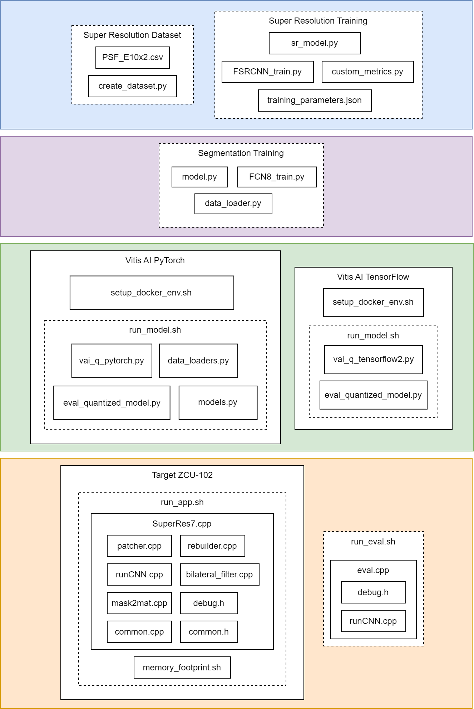

# LICENSES

# Super Resolution Dataset

create_dataset.py

Python Software Foundation License

      
  - arpgarse
  - multiprocessing
  - os

The 2-Clause BSD License

      
  - cv2

The 3-Clause BSD License

    
  - NumPy

MIT

    
  - tqdm

# Super Resolution Training 

FSRCNN_training.py

Apache 2.0 License

    
  - TensorFlow

Python Software Foundation License

      
  - arpgarse
  - gc
  - json
  - os

The 2-Clause BSD License

      
  - cv2
  - scikit-learn

The 3-Clause BSD License

    
  - NumPy

Matplotlib License

    
  - matplotlib

MIT

    
  - tqdm
  - livelossplot

sr_model.py

Apache 2.0 License

      
  - TensorFlow

custom_metrics.py

Apache 2.0 License

      
  - TensorFlow

# Segmentation Training 

model.py

The 3-Clause BSD License

    
  - PyTorch

FCN8_train.py

The 3-Clause BSD License

    
  - PyTorch

data_loader.py

The 3-Clause BSD License

    
  - PyTorch

# Target ZCU-102

run_app.sh

MIT

  
  - OpenCV

patcher.cpp

The 2-Clause BSD License

  - OpenCV

GPL License (GNU General Public License)

    
  - iostream
  - string
  - vector

rebuilder.cpp

The 2-Clause BSD License

      
  - OpenCV

GPL License (GNU General Public License)

    
  - iostream
  - string
  - vector
  - dirent.h
  - sys/stat.h

runCNN.cpp

The 2-Clause BSD License

      
  - OpenCV

GPL License (GNU General Public License)

    
  - assert.h
  - dirent.h
  - stdio.h
  - stdlib.h
  - sys/stat.h
  - unistd.h
  - chrono
  - cassert
  - cmatg
  - cstdio
  - fstram
  - sstream
  - iomanip
  - iostream
  - queue
  - string
  - vector
  - thread

//common.h

bilateral_filter.cpp

The 2-Clause BSD License

    
  - OpenCV

mask2mat.cpp

The 2-Clause BSD License

  - OpenCV

GPL License (GNU General Public License)

    
  - iostream
  - string
  - vector
  - dirent.h
  - sys/stat.h
  - cmath

common.cpp

GPL License (GNU General Public License)

      
  - cassert
  - numeric

//common.h

common.h

Apache 2.0 License

      
  - glog
  - XIR

The 2-Clause BSD License

      
  - OpenCV

GPL License (GNU General Public License)

      
  - iostream
  - mutex
  - string
  - thread
  - vector

//vitisAI

# Vitis AI TensorFlow

setup_docker_env.sh

Apache 2.0 License

      
  - TensorFlow

The 2-Clause BSD License

      
  - seaborn
  - scipy

GPL License (GNU General Public License)

      
  - libgfortran4

//vai_quantizer

vai_q_tensorflow2.py

Apache 2.0 License

      
  - TensorFlow

MIT

      
  - OpenCV

Python Software Foundation License

      
  - arpgarse
  - os

The 3-Clause BSD License

    
  - NumPy

Matplotlib License

    
  - matplotlib

//config.py

eval_quantized_model.py

Apache 2.0 License

      
  - TensorFlow

MIT

      
  - OpenCV

Python Software Foundation License

      
  - arpgarse
  - os

The 3-Clause BSD License

    
  - NumPy

Matplotlib License

    
  - matplotlib

//config.py

# Vitis AI PyTorch

run_model.sh

MIT

vai_q_pytorch.py

MIT

      
  - OpenCV

Python Software Foundation License

      
  - arpgarse
  - os

The 3-Clause BSD License

    
  - PyTorch
  - NumPy

data_loaders.py

Python Imaging Library

Python Software Foundation License

      
  - os

The 3-Clause BSD License

    
  - PyTorch

models.py

The 3-Clause BSD License

    
  - PyTorch

# Licenses details

- [**Apache 2.0 License**](https://www.apache.org/licenses/LICENSE-2.0): The Apache 2.0 License is permissive. It allows you to use, modify, and distribute the licensed software, including creating derivative works, without requiring those derivative works to be licensed under the same terms.

- [**The 2-Clause BSD License**](https://opensource.org/license/bsd-2-clause/): The BSD License allows users to do almost anything with the software, including modifying, distributing, and using it for commercial purposes, without imposing significant restrictions on how the software can be used or distributed.

- [**The 3-Clause BSD License**](https://opensource.org/license/bsd-3-clause/): The New BSD License is similar to the 2-Clause BSD License but includes an additional clause, often referred to as the "advertising clause. The "Endorsement Clause (Advertising Clause)” says that neither the name of the copyright holder nor the names of its contributors may be used to endorse or promote products derived from this software without specific prior written permission.

- [**GNU Affero General Public License v3.0**](https://www.gnu.org/licenses/agpl-3.0.en.html): The GNU Affero General Public License v3.0 is based on the GNU General Public License (GPL) version 3.0, with an additional clause addressing network use. The AGPLv3 extends the principles of the GPL to cover the distribution of software over a network, ensuring that users who interact with the software over a computer network also have access to the source code of that software.

- [**GPL License (GNU General Public License)**](https://www.gnu.org/licenses/gpl-3.0.html): The GPL License is designed to ensure that software distributed under its terms remains free and open, allowing users to access, modify, and distribute the software freely.

- [**Matplotlib License**](https://github.com/matplotlib/matplotlib/blob/main/LICENSE/LICENSE): The Matplotlib License is a permissive open-source license that allows for the free use, modification, and distribution of the library, including for commercial purposes, with certain conditions.

- [**MIT**](https://opensource.org/license/mit/): MIT license allows users to do almost anything they want with the software, as long as they include the original copyright notice and disclaimer.

- [**Python Imaging Library**](https://github.com/python-pillow/Pillow/blob/ceb0c575e8c61a2d2b164f7f3e06d867804e304e/LICENSE): Python Imaging Library license allows users to obtain, use, copy, modify, and distribute the software and its associated documentation under certain conditions.

- [**Python Software Foundation License**](https://www.python.org/download/releases/3.4.0/license/): PSF is a permissive open-source license that allows users to freely use, modify, and distribute Python, both for commercial and non-commercial purposes, without many of the restrictions found in copyleft licenses like the GNU General Public License (GPL).
